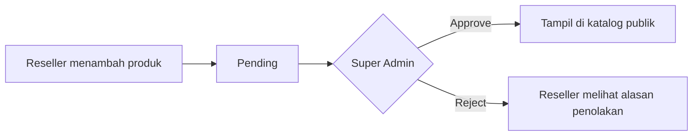

<div align="center">

# 🛍️ BD Katalog

**Katalog digital produk mahasiswa untuk Business Development**
<br>
Tempat memperkenalkan produk, karya, dan potensi bisnis mahasiswa dalam satu platform.

<br>

[](https://katalogbd.usri.cloud)


[Fitur](#-fitur) · [Alur](#-alur-persetujuan-produk) · [Instalasi](#-instalasi) · [Akses](#-akses) · [Deployment](#-deployment)

</div>

---

## 📌 Overview

BD Katalog adalah **digital storefront**, bukan marketplace. Pengunjung dapat melihat produk, mencari berdasarkan nama atau kategori, mengenal mahasiswa di balik setiap produk, lalu memesan langsung melalui WhatsApp penjual.

| Bagian                    | Untuk      | Fungsi                                                       |
| ------------------------- | ---------- | ------------------------------------------------------------ |
| 🌐 **Website publik**     | Pengunjung | Melihat katalog, berita, kolaborasi, dan menghubungi penjual |
| 👤 **Dashboard reseller** | Mahasiswa  | Mengelola profil dan mengajukan produk                       |
| 🛡️ **Panel Super Admin**  | Admin BD   | Mengelola data dan menyetujui produk                         |

## ✨ Fitur

| 🌐 Website publik                                                                                                                                                                                                                                                                  | 👤 Reseller                                                                                                                                                             | 🛡️ Super Admin                                                                                                           |
| ---------------------------------------------------------------------------------------------------------------------------------------------------------------------------------------------------------------------------------------------------------------------------------- | ----------------------------------------------------------------------------------------------------------------------------------------------------------------------- | ------------------------------------------------------------------------------------------------------------------------ |
| Katalog dengan pencarian dan filter kategori<br>Detail produk: galeri, keunggulan, produk serupa<br>Produk populer dan produk baru<br>Profil penjual ("Sosok di Balik Produk")<br>Pesan via WhatsApp<br>Tentang BD, Kolaborasi, Kabar Terbaru, Kontak<br>Chatbot FAQ<br>Responsive | Registrasi dan login<br>Dashboard ringkasan produk<br>Kelola profil dan foto profil<br>Tambah produk, banyak foto, dan keunggulan<br>Pantau status dan alasan penolakan | Kelola kategori, reseller, dan produk<br>Setujui atau tolak produk<br>Kelola berita dan kolaborasi<br>Kelola FAQ chatbot |

## 🔄 Alur Persetujuan Produk



Status produk: `pending`, `approved`, `rejected`. Hanya produk `approved` yang tampil di katalog.

## 🧰 Tech Stack

PHP 8.2+ · Laravel · MySQL · Blade · Filament · Vite

## ⚙️ Requirements

- PHP 8.2 atau lebih baru
- Composer
- Node.js 20+ dan npm
- MySQL
- Git
- Ekstensi PHP: `pdo_mysql`, `mbstring`, `openssl`, `fileinfo`, `tokenizer`, `xml`, `intl`

> [!TIP]
> Pengguna Windows disarankan memakai **Laragon**, karena PHP, MySQL, dan Composer sudah tersedia.

## 🚀 Instalasi

**1. Clone repository**

```bash
git clone https://github.com/Riahulina/Business-Decelopment-Katalog.git
cd Business-Decelopment-Katalog
```

**2. Install dependency**

```bash
composer install
npm install
```

**3. Buat file `.env`**

```bash
cp .env.example .env
```

> Windows PowerShell: `Copy-Item .env.example .env`

**4. Atur database di `.env`**

```env
APP_URL=http://127.0.0.1:8000

DB_CONNECTION=mysql
DB_HOST=127.0.0.1
DB_PORT=3306
DB_DATABASE=bd_katalog
DB_USERNAME=root
DB_PASSWORD=
```

**5. Buat database**

```sql
CREATE DATABASE bd_katalog CHARACTER SET utf8mb4 COLLATE utf8mb4_unicode_ci;
```

**6. Generate key, migrasi, dan data awal**

```bash
php artisan key:generate
php artisan migrate
php artisan db:seed
php artisan storage:link
```

**7. Build frontend dan jalankan**

```bash
npm run build
php artisan serve
```

Buka **http://127.0.0.1:8000**

> [!NOTE]
> Untuk development, jalankan `npm run dev` di terminal kedua.

## 🔑 Akses

| Bagian             | URL          |
| ------------------ | ------------ |
| Website            | `/`          |
| Katalog produk     | `/produk`    |
| Dashboard reseller | `/dashboard` |
| Panel Super Admin  | `/admin`     |

Akun reseller dibuat melalui halaman **Daftar**. Panel admin hanya dapat diakses akun dengan role Super Admin.

## 🗄️ Database

| Tabel                | Isi                           |
| -------------------- | ----------------------------- |
| `users`              | Akun dan role                 |
| `resellers`          | Profil mahasiswa penjual      |
| `categories`         | Kategori produk               |
| `products`           | Produk dan status persetujuan |
| `product_images`     | Foto produk                   |
| `product_highlights` | Keunggulan produk             |
| `news`               | Berita                        |
| `collaborations`     | Kolaborasi                    |

## 🌍 Deployment

<details>
<summary><b>Klik untuk melihat langkah deployment ke server</b></summary>

<br>

```bash
composer install --no-dev --optimize-autoloader
npm install && npm run build
cp .env.example .env
php artisan key:generate
```

Atur `.env` production:

```env
APP_ENV=production
APP_DEBUG=false
APP_URL=https://domain-anda.com
```

Isi konfigurasi database, lalu jalankan:

```bash
php artisan migrate --force
php artisan db:seed --force
php artisan storage:link
php artisan optimize
```

> [!WARNING]
> Arahkan document root server ke folder `public`. Folder `storage` dan `bootstrap/cache` harus dapat ditulis oleh web server. Jangan jalankan `migrate:fresh` di production karena akan menghapus seluruh data.

</details>

---

<div align="center">
<sub>Dibuat untuk kebutuhan Business Development dan kompetisi pengembangan website.</sub>
</div>
